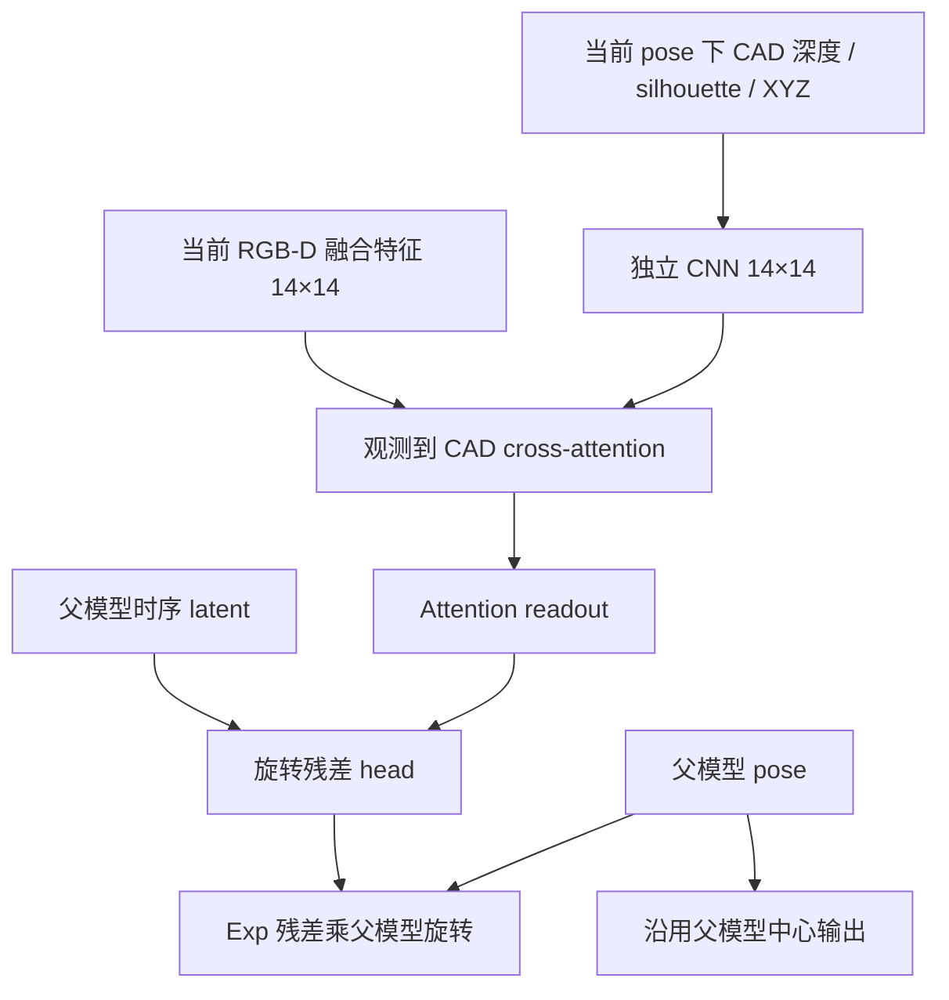

# 启动帧内校正与专用旋转对齐分支

**终态：两阶段均已完成。旋转分支相对同预算对照未证明增益，
且增加约 2.6 ms 中位延迟；未晋级，仍保留旧 residual。
[完整完成报告](ROTATION_ALIGNMENT_RESULTS_20260915.md)。
以下保留实施与启动时记录。**

## 第一阶段：冻结权重的全量对照已完成

固定保留的 residual 权重 `89d5a66bc72d8afc5eb57d20b4a4ba52964dc7706dc7058af8bb9a01cde15868`，
两种方法使用相同真实 PoseCNN 初值，各跑 s0 val 320 流、23,200 帧。
LIP 全程零 FP；首个 RGB-D 仅编码并保留外部初值；之后前八帧分别
做一次或两次校正，后续均一次。没有训练或 GT 重置，缺失初值仍为失败。

两次校正均读取同一份不可变历史。第二次使用第一次的临时 pose
重新 crop/render，但物理帧间运动仍由真正的已接受历史计算。只提交
最后一次合法预测和对应当前帧 KV，第二次失败则保留第一次。
不重复追加当前帧、修改历史源坐标或伪造时间。仅支持 functional
residual cache；单次默认行为保持不变。

| 指标 | 一次 | 启动两次 | 两次减一次，配对 95% CI |
|---|---:|---:|---:|
| 总体 ADD <0.1d | 57.194% | 57.325% | +0.132 pp [−0.104, 0.374] |
| 总体 ADD-S <0.05d | 83.664% | 84.052% | +0.388 pp [0.190, 0.583] |
| 严重遮挡 ADD-S <0.05d | 29.278% | 29.056% | −0.222 pp [−0.408, 0.000] |
| 坏初值前八帧 ADD <0.1d | 54.967% | 59.038% | +4.071 pp [2.782, 5.135] |
| 坏初值前八帧 ADD-S <0.05d | 79.494% | 83.664% | +4.170 pp [2.959, 5.313] |
| 坏初值前八帧旋转误差 | 44.102° | 43.703° | −0.398° [−0.890, 0.178] |
| 坏初值前八帧中心误差 | 13.984 mm | 11.958 mm | −2.026 mm [−2.512, −1.519] |

以上为 object-macro native val，40 物理序列、2,000 次共享 bootstrap，
未作多重比较校正。严重遮挡 visibility 使用 native proxy，不是 BOP
visib_fract；这些分数不是 official test AR。

单进程 H20、CPU RGB-D 输入到 CPU pose 输出、排除 IO 的 20 类固定
流实测（每流 32 次更新）：

| 耗时 | 一次 | 启动两次 |
|---|---:|---:|
| 前八次更新 P50 | 21.766 ms | 42.128 ms |
| 前八次更新 P95 | 23.225 ms | 44.809 ms |
| 第九次之后 P50 | 21.836 ms | 21.966 ms |
| 第九次之后 P95 | 23.322 ms | 23.341 ms |

结论：增加一次校正有明确启动成功率/中心收益，但旋转改善区间仍
包含零，严重遮挡严格点值略降，启动延迟接近翻倍。保持默认一次，
两次作为显式实验选项 `--startup-iterations 2`；不声称全面更优。
通用 comparison.json 中的 `selected=residual` 是工具默认训练选择
字段，本阶段没有做训练权重选择，应以本报告的迭代实验结论为准。

第一轮测试有一个因隔离目录缺少配置文件而失败，日志保留；补齐
项目 configs 后重新运行得到 32 passed、2 skipped。另有 4 CUDA
测试和 7 统计/边界测试通过。单次路径在当前源码下完整复现旧模型
23,200 帧的 pose、状态与阈值分数。两次缓存、真实历史运动、失败
回退和零残差梯度均有测试。

[完整逐帧数据和配对统计](../runs/intraframe_completed_20260915/evidence/intraframe/comparison/comparison.json)。
[单次复现凭据](../runs/intraframe_completed_20260915/evidence/intraframe/baseline_reproduction.json)。
[阶段完成凭据](../runs/intraframe_completed_20260915/evidence/intraframe/receipt.json)。
[本地逐文件核验](../runs/intraframe_completed_20260915/verified.json)。
[启动恢复曲线](../runs/intraframe_completed_20260915/intraframe_figures/bad_start_first8.png)。

归档包含 58 个证据文件，SHA：
`3ecc0280ff1d31c2d6976cfaab09de7c2d35e3e3ed332c0aae2e3346de0bf84e`。

## 第二阶段：旋转分支实现与预检完成，正式训练已启动

第一版使用现有 CAD 几何渲染，不额外依赖纹理、FP 或手标注。
新增 `RotationAlignmentTracker` 复用父模型的编码、时序和中心 head，
通过显式 config `rotation_alignment: true` 启用：

14×14 观测特征在池化到父模型 4×4 路径之前保留；CAD encoder
仅取 geometry 第 2–6 通道，即渲染深度、轮廓与 XYZ。新分支输出
三维旋转残差，不输出平移。最后一层权重和 bias 为零，其他匹配
层正常初始化；不使用两个相乘的零门/零分支造成梯度死区。
缓存格式仍为 residual functional cache，权重加载严格检查
rotation_alignment 标志，新增参数不静默忽略。

真实预检结果：

- 52 CPU + 4 CUDA 测试通过。
- 真实 train RGB-D 与真实 PoseCNN 初值：CPU FP32 八步、GPU FP32
  和 BF16 各十六步，训练接口/在线接口以及零残差/父模型预测均逐位
  相同，最大差为零。
- 三步 FP32 pilot loss 为 0.067778 → 0.058777 → 0.055096。
  所有可训练梯度有限；新 CAD encoder 第二步起具有非零梯度；
  旋转残差已产生非零输出。pilot 权重和 optimizer 丢弃。
- batch16 单卡显存探测、四卡 DDP 三步及恢复到第四步通过。
  对照 / 新分支 PyTorch 峰值约 30.55 / 35.04 GB（十进制），
  并非完整设备峰值。

正式两组均从保留的 `89d5a66b…` 父权重开始、fresh optimizer，
相同 64,000 个片段、seed42、真实初值混合、S1O1、1,000 步预算。
两组各四张 H20；RGB 主干全阶段冻结，其他父模块按相同小学习率
适配；新对齐分支 lr=1e-4。中心分支结构保留，但其非 RGB 参数
并未全部冻结。即使冻结中心参数，旋转改变下一帧 crop 也会影响
闭环中心，因此最后仍检查中心指标。

两组正式训练均每帧一次校正，将结构影响与第一阶段的额外迭代分开。
完训后自动做完整 native val 和速度测量。新候选须保护父模型总体
ADD、总体/严重遮挡严格分数、前八帧中心，同时前八帧旋转相对
同预算对照和旧父模型均具有有利配对区间，才能晋级。固定只看
final1000，不启动新的 official test。

[旋转分支预检与训练启动快照](../runs/rotation_alignment_preflight_20260915/evidence/runs/alignment_pair/equivalence.json)
已回传并核验 434 个文件；它是运行中快照，不是最终训练结果。
当前不能报告新结构精度收益，仍需等待正式训练和完整验证。

## 入口和真实路径

- 每帧事务：[intraframe.py](../src/lip/engine/intraframe.py)。
- 旋转分支：[rotation_alignment.py](../src/lip/models/rotation_alignment.py)。
- 单次／双次全量入口：[run_intraframe_comparison.py](../tools/run_intraframe_comparison.py)。
- 旋转训练分阶段入口：[run_rotation_alignment_stages.py](../tools/run_rotation_alignment_stages.py)。

服务器：`/mnt/why/dexycb_lip/intraframe_alignment_20260915/runs/`

- `intraframe/`：已完成冻结对照、评分和独立测速。
- `alignment_pair/`：预检、两组配置、训练日志与 checkpoint。
- `alignment_stages/status.json`：预检/训练/验证/归档总状态。
- `alignment_val/`：完训后的完整验证与选择（尚待生成）。
- `alignment_completed/`：最终核验/归档（尚待生成）。

本地自动回传状态：
`runs/intraframe_alignment_20260915_completion/status.json`。
失败会记录明确阶段并停止后续步骤；完整归档生成后自动下载并逐文件
核验，不把训练中的快照称为最终完成。
