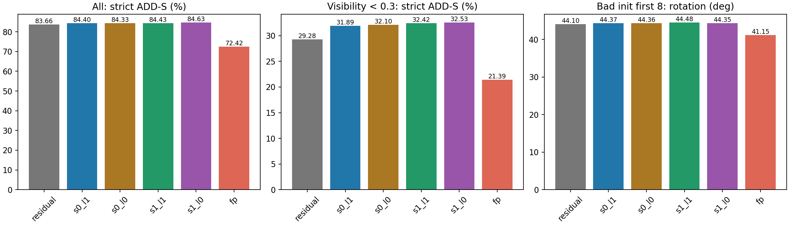
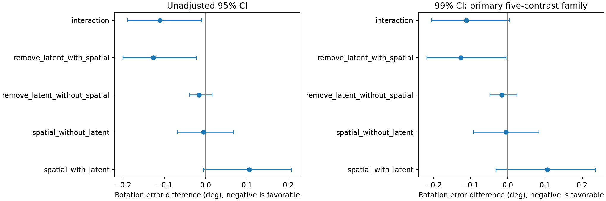
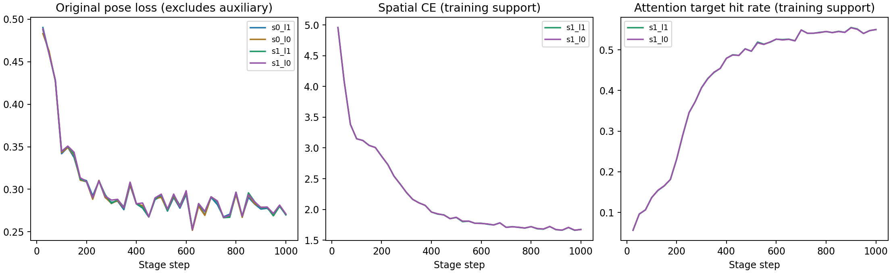

# 显式空间监督 × 父 latent：完整 2×2 结果

四组各完成 1,000 步、64,000 次相同片段采样，及 320 流 / 23,200 帧真实初始化、零 FP native s0 val。以下为最终固定步数，一次训练种子；没有自动晋级或新 official test。

本轮判读：**辅助对应任务能学，但空间监督尚未带来可靠的启动恢复收益。
在有空间监督时，切断新分支的父 latent 输入有小幅旋转收益；仍未超过
无空间监督、同样切断 latent 的对照。保留原父权重。**

- 两个空间监督组的首/末 25 步窗口，训练 CE 约 4.96 → 1.67，
  对应命中率约 5.6% → 55.0%。这是训练支持点上的指标，不是 val 对应精度。
- 有空间监督时，去 latent 的启动旋转误差减少 0.126586°，主项五对比族
  99% 区间 [−0.217218, −0.004160]；但去 latent 后再比较有/无空间
  监督，差仅 −0.005009°，95% 区间 [−0.068215, +0.067366]。
- 开启空间监督使坏初值前八帧严格 ADD-S 分别减少 0.522637 pp
  （保留 latent，95% CI [−0.807156, −0.231964]）和 0.470779 pp
  （去 latent，[−0.742953, −0.148066]），中心误差分别增加
  0.165244 mm / 0.159602 mm，两项未校正 95% 区间均为正。
- 总体/严重遮挡的最高点值是 s1_l0 的 84.625684% / 32.533492%，
  但它的启动旋转为 44.353512°，同协议 FP 为 41.151437°。
  不以总体点值覆盖启动回退，不据单种子宣称稳定结构增益。

后续优先检查已记录的深度门槛覆盖缺失，以及辅助梯度改变共享父特征/
后续 crop 的影响；这些机制尚未被本轮唯一识别。本轮没有自动追加重训。

| 方法 | 总体严格 ADD-S (%) | 严重遮挡严格 (%) | 坏初值前八帧旋转 (°) | 启动中心 (mm) |
|---|---:|---:|---:|---:|
| residual | 83.664154 | 29.278211 | 44.101813 | 13.983866 |
| s0_l1 | 84.403890 | 31.893175 | 44.374258 | 13.084996 |
| s0_l0 | 84.326480 | 32.098555 | 44.358521 | 13.118899 |
| s1_l1 | 84.428816 | 32.419060 | 44.480099 | 13.250240 |
| s1_l0 | 84.625684 | 32.533492 | 44.353512 | 13.278501 |
| fp | 72.419142 | 21.388733 | 41.151437 | 14.479153 |

S1：空间监督权重 0.05；L1：新分支读取父 latent。L0 只切断这条直接输入，不移除父模型或 dense 特征已有的几何。

| 启动旋转的预设对比 | 差值 (°) | 95% CI | 99% CI |
|---|---:|---|---|
| spatial_with_latent | +0.105840 | [-0.005415469616610302, 0.2081870679357884] | [-0.031140639432983827, 0.23593399207539462] |
| spatial_without_latent | -0.005009 | [-0.06821536782653528, 0.06736615787188001] | [-0.09249762301920984, 0.08410972075544731] |
| remove_latent_without_spatial | -0.015737 | [-0.03888135536817856, 0.016001126513604722] | [-0.047909581046880235, 0.024899296301496017] |
| remove_latent_with_spatial | -0.126586 | [-0.20006859288190154, -0.022704820205505207] | [-0.2172184163502945, -0.004160163677963992] |
| interaction | -0.110849 | [-0.18852226735769761, -0.009473706112039975] | [-0.205184666466789, 0.004704425412509287] |

按预设五对比族 99% 区间，支持启动旋转降低的条件效应：remove_latent_with_spatial。这不自动代表总体、中心、遮挡和延迟同时改善；interaction 必须结合条件效应解释。

训练 CE/命中率使用各自闭环产生的可见对应点，支持集合会变化；不能拿训练损失直接当作跨模型验证精度。完整 val 才是共同帧上的部署对照。

| 方法 | steady P50 (ms) | P95 (ms) |
|---|---:|---:|
| residual | 21.891 | 23.438 |
| s0_l1 | 25.074 | 27.043 |
| s0_l0 | 25.375 | 26.949 |
| s1_l1 | 25.431 | 27.588 |
| s1_l0 | 25.011 | 26.486 |

65 项不同的 CPU 检查、4 项 CUDA 检查、真实零起点、单卡显存、双卡 DDP 保存恢复均通过。父权重全量预测精确复现。正式相机/mesh/单位不变；对称对象仅排除辅助对应监督，仍参与位姿训练和全部评测。

[本地归档校验](../reports/spatial_alignment_20260915/archive_verification.json)。
