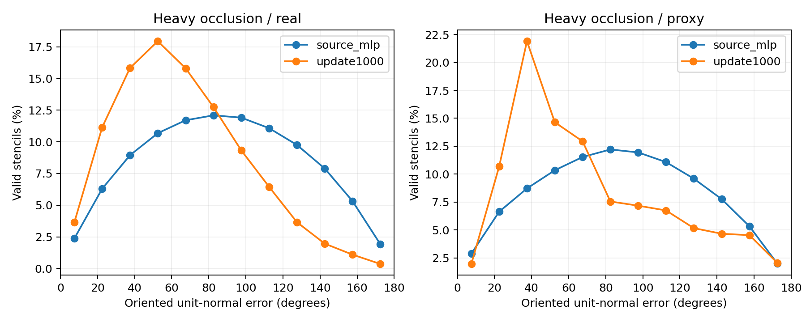

# 法线退化与方向诊断 / Frozen normal audit

结论：旧MLP接近90°不是零向量或epsilon归一化造成的主导假象。退化不足0.2%，有效单位法线仍接近89°；去掉正反号后仍约55°，也不是单纯翻号。新DPT主要减少错误半球朝向，去符号后的角误差基本未改善。旧头patch内部比跨patch边界更差，说明问题不只在拼接接缝。

Same fixed40 sequences, same crops and target stencils; no training. Table: controlled heavy occlusion, equal frame/case/sequence mass. Strides1/2 pooled within each frame.

Degenerate: nonfinite prediction, tangent length <=1e-4 object diameters, or tangent sine <=0.05. Target eligibility is unchanged. Unit angle and sign metrics exclude these predictions; their failure rate is reported separately. Negative dot means angle >90 degrees, not proof of a pure sign reversal. Unoriented angle is acos(abs(dot)); near-opposite means angle >=150 degrees.

| Model | Target | Degenerate % | Unit angle deg | Negative dot % | Unoriented angle deg | Near opposite % |
|---|---|---:|---:|---:|---:|---:|
| source_mlp | real | 0.1372 | 88.4605 | 48.3230 | 55.3844 | 7.4361 |
| source_mlp | proxy | 0.1771 | 88.7790 | 48.8456 | 55.3459 | 7.1491 |
| update1000 | real | 0.0122 | 72.0717 | 29.9633 | 54.3046 | 3.0952 |
| update1000 | proxy | 0.0167 | 78.8231 | 38.2724 | 55.5955 | 4.6825 |

## Within-patch vs cross-patch unit angle

| Model | Target | Within patch deg | Cross patch deg |
|---|---|---:|---:|
| source_mlp | real | 90.2819 | 85.9040 |
| source_mlp | proxy | 91.3873 | 83.9547 |
| update1000 | real | 71.9886 | 71.5962 |
| update1000 | proxy | 78.9439 | 78.4560 |

Threshold components overlap; do not add their percentages. Detailed source JSON also reports each stencil scale, nonfinite/zero/small/collinear fractions, legacy-normal attenuation, raw counts and pixel-pooled metrics. Histograms below are pooled valid stencils, not equal-sequence averages.

